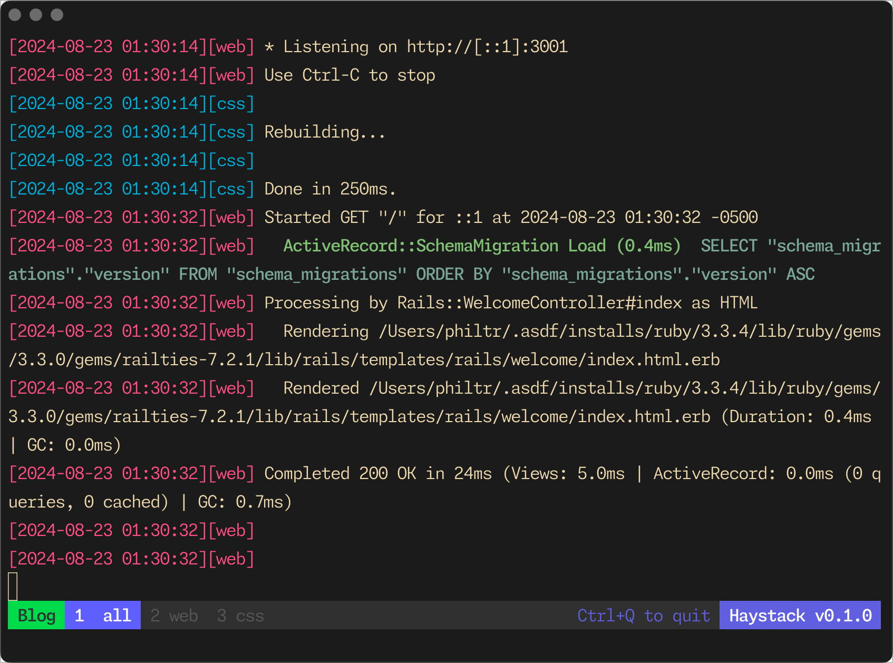

# Haystack

Haystack is a powerful tmux-based process management tool designed for
streamlining development environments. It allows you to easily manage multiple
processes defined in a Procfile, providing a clean and efficient interface for
monitoring and controlling your development stack.



## Features

- **Procfile Support**: Easily start and manage multiple processes defined in a
  Procfile.
- **Tmux Integration**: Utilizes tmux for efficient terminal multiplexing and
  process management.
- **Colorized Output**: Each process output is uniquely colored for easy
  differentiation.
- **Combined Log View**: View all process logs in a single, combined window.
- **Environment Variable Support**: Automatically loads environment variables
  from `.env` files.
- **Easy Navigation**: Use Alt+[number] to quickly switch between process
  windows.
- **One-Command Shutdown**: Gracefully stop all processes with a single key
  combination (Ctrl+Q).
- **Self-Update Mechanism**: Easily update Haystack to the latest version with a
  simple command.

## Installation

1. Download the Haystack script:

   ```sh
   curl -o bin/haystack https://raw.githubusercontent.com/philtr/haystack/main/haystack
   ```

1. Make the script executable:

   ```sh
   chmod +x bin/haystack
   ```

## Usage

1. Navigate to your project directory containing a Procfile.

1. Run Haystack:

   ```sh
   bin/haystack
   ```

   By default, Haystack looks for a file named `Procfile.dev`. If you want to
   use a different Procfile, specify it as an argument:

   ```sh
   bin/haystack Procfile.local
   ```

1. Haystack will start all processes defined in your Procfile within a tmux session.

1. Use the following commands within the Haystack session:
   - `Alt+[number]`: Switch to a specific process window
   - `Alt+1`: View the combined log output
   - `Ctrl+Q`: Gracefully shut down all processes and exit Haystack

## Updating Haystack

To update Haystack to the latest version, run:

```sh
haystack --update
```

## Configuration

Haystack uses the following files for configuration:

- `Procfile.dev` (or the specified Procfile): Defines the processes to run.
- `.env.development` or `.env`: Defines environment variables for your processes.

## Contributing

Contributions to Haystack are welcome! Please feel free to submit pull requests,
create issues, or suggest new features.

## License

Haystack is open-source software licensed under the MIT license.

## Author

Haystack is created and maintained by [@philtr](https://github.com/philtr). For questions,
suggestions, or support, please [open an
issue](https://github.com/philtr/haystack/issues) on the GitHub repository.

## AI Disclaimer

**Important**: This entire project, including all code and documentation, was
generated using AI. While efforts have been made to ensure functionality and
safety, users should use this software at their own risk. Always review and test
thoroughly before using in any critical environments.
